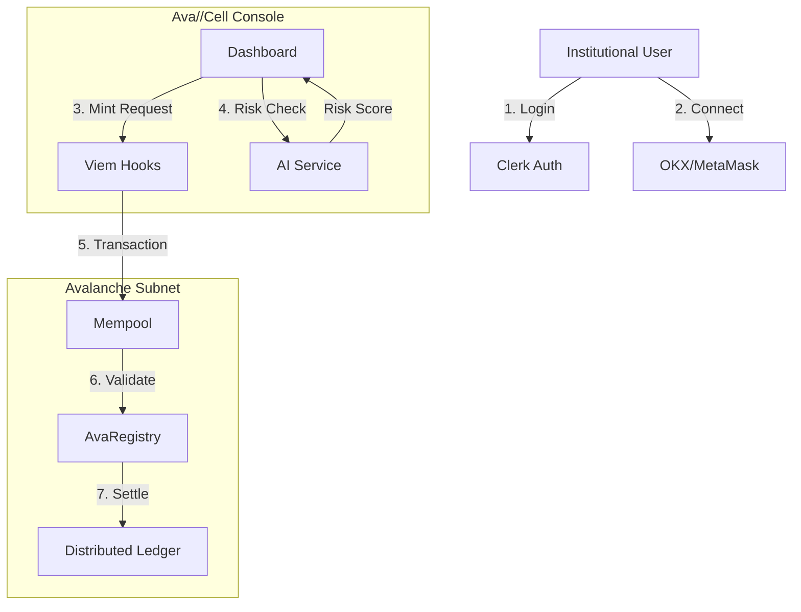

# System Architecture

Ava//Cell is designed as a modular 3-tier application, ensuring separation of concerns between the User Interface, the Regulatory Logic, and the Settlement Layer.

## 1. Settlement Layer (Avalanche Subnet)

The foundation of the network is the **Ava//Cell Subnet**, a dedicated EVM-compatible blockchain.

- **Consensus**: Snowman Protocol (Proof-of-Authority for Testnet).
- **Native Token**: $CELL (Used for Gas).
- **Contracts**:
    - `AvaComplianceRegistry.sol`: The "Rule Engine". Stores risk scores and mapping of valid DIDs.
    - `AvaRWAAsset.sol`: An ERC-20 token that *inherits* from the Registry. It overrides `_update` to call `Registry.checkCompliance(from, to)` before every transfer.
    - `AvaStablecoin.sol`: ERC-20 settlement token (USD-pegged).

## 2. Intelligence Layer (AI Microservice)

A Python-based centralized oracle service that provides off-chain risk data.

- **Stack**: FastAPI, Scikit-Learn.
- **Function**:
    - Watches Mempool or receives API calls from the Dashboard.
    - Calculates a real-time `RiskScore` (0.0 - 1.0) based on wallet history and geo-location.
    - **Note**: In a production Mainnet version, this would be decentralized via Chainlink Functions or an AVS.

## 3. Interface Layer (Next.js Dashboard)

The "Console" for institutional operators.

- **Framework**: Next.js 14 (App Router).
- **State Management**: React Hooks + Viem (for Blockchain State).
- **Data Visualization**: Recharts (Financials) + R3F (Globe).
- **Authentication**: Clerk (Identity) + SIWE (Wallet Binding).

## Data Flow Diagram

